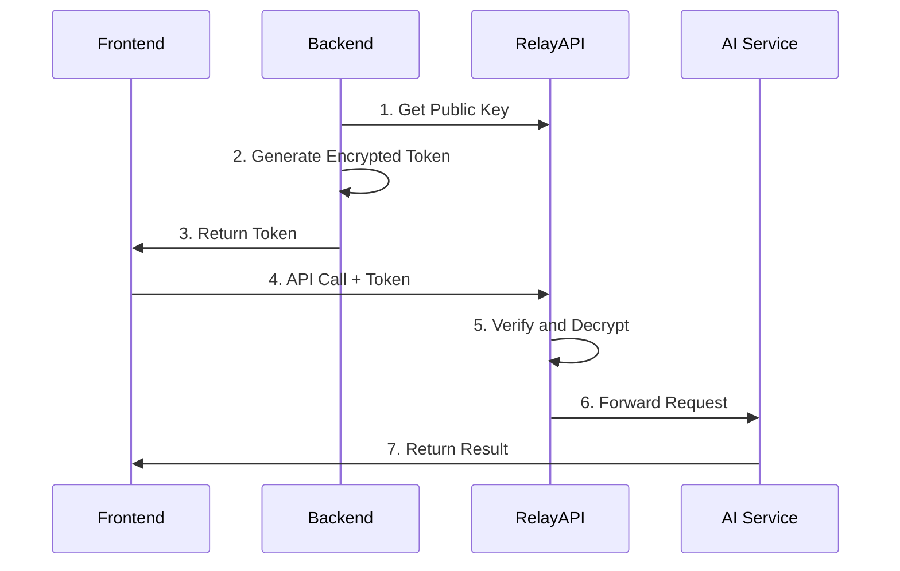

<div align="center">
  <h1>🚀 RelayAPI</h1>
  <p><strong>A secure, high-performance API proxy layer for secure AI service calls from frontend</strong></p>
  <p>
    <a href="README_CN.md">中文文档</a>
  </p>
  <p>
    <a href="https://github.com/relayapi/RelayAPI/stargazers">
      
    </a>
    <a href="https://github.com/relayapi/RelayAPI/network/members">
      
    </a>
    <a href="https://github.com/relayapi/RelayAPI/issues">
      
    </a>
    <a href="https://github.com/relayapi/RelayAPI/blob/main/LICENSE">
      
    </a>
  </p>
</div>

## 🌟 Features

- 🔒 **Zero Risk of Leakage**: API Keys are fully encrypted and stored on the server side, frontend has no access to sensitive information
- 🚀 **High Performance**: High-performance proxy service implemented in Go, supporting large-scale concurrency
- 🎯 **Precise Control**: Support multi-dimensional access control by calls, time, IP, etc.
- 🔌 **Plug and Play**: Support 90+ AI service providers, zero frontend changes, only need to modify BaseURL
- 📊 **Real-time Monitoring**: Built-in call volume statistics, performance monitoring, error tracking, etc.
- 🛡️ **Multiple Protection**: Support IP whitelist, call rate limiting, concurrency control, and other security features
- 🌐 **Multi-language SDKs**: Provide Node.js, Python, Go, and other language SDKs

## 🎯 How Does It Work?



## 🚀 Quick Start

### Installation

```bash
# RelayAPI Server Quick Install
curl -fsSL https://relayapi.com/get_relayapi.sh | sh
```

```bash
# Backend SDK Installation
npm install relayapi-sdk    # Node.js (@https://www.npmjs.com/package/relayapi-sdk)
pip install relayapi-sdk    # Python (@https://pypi.org/project/relayapi-sdk/)
```

### Configuration

RelayAPI requires two types of configuration files:

1. `config.json` - Server configuration file (required)
   - Contains server settings, rate limits, and logging configuration
   - Must be present when starting the server
   - Example: [Server Configuration Guide](server/README.md)

2. `default.rai` - Client configuration file (auto-generated if not present)
   - Contains encryption settings and server connection information
   - Used by SDKs to generate tokens and connect to the server
   - Can be loaded from file or passed as object
   - Example: [JavaScript SDK Guide](backend-sdk/JavaScript/README.md) | [Python SDK Guide](backend-sdk/python/README.md)

For detailed configuration options and examples, please refer to our [Configuration Guide](docs/configuration.md).

### Backend Usage Example

```typescript
import { RelayAPIClient } from 'relayapi-sdk';
import fs from 'fs/promises';

// Load configuration file
const configContent = await fs.readFile('default.rai', 'utf-8');
const config = JSON.parse(configContent);

// Create client instance
const client = new RelayAPIClient(config);

// Generate encrypted token
const token = client.createToken({
    apiKey: 'your-api-key',     // API Key
    maxCalls: 100,              // Maximum number of calls
    expireSeconds: 3600,        // Expiration time (seconds)
    provider: 'openai'          // AI service provider
});

// Generate API URL
const baseUrl = client.generateUrl(token);
console.log('Base URL:', baseUrl);
// Output example: http://localhost:8840/relayapi/?token=xxxxx&rai_hash=xxxxx

// Return to frontend
return { baseUrl, token };
```

### Frontend Usage Example

```typescript
import OpenAI from 'openai';

const openai = new OpenAI({
    baseURL: baseUrl,
    apiKey: 'not-needed'  // API Key is already included in the token
});

const response = await openai.chat.completions.create({
    messages: [{ role: 'user', content: 'Hello!' }],
    model: 'gpt-3.5-turbo',
    temperature: 0.7,
    maxTokens: 1000
});
```

## 🌈 Supported AI Service Providers

### Mainstream AI Model Services
- OpenAI (GPT-4, GPT-3.5)
- Anthropic (Claude)
- Google AI (PaLM, Gemini)
- Mistral AI
- Cohere
- AI21 Labs
- Hugging Face

### Cloud Provider AI
- Azure OpenAI
- AWS Bedrock
- Google Cloud AI
- Alibaba Cloud Tongyi Qianwen
- Baidu ERNIE
- Tencent Hunyuan
- Huawei Pangu

### Professional Domain AI
- Stability AI (Image Generation)
- DeepL (Translation)
- AssemblyAI (Speech Recognition)
- Speechmatics (Speech Processing)
- RunwayML (Video Generation)
- Wolfram Alpha (Scientific Computing)

> For a complete list, please check [Supported Providers List](docs/providers.md)

## 🔐 Security Notes

1. **Zero Trust Architecture**
   - API Keys are only stored and used on the server side
   - All tokens are one-time use
   - Support IP binding and geolocation restrictions

2. **Multiple Encryption**
   - Using AES, ECC, and other encryption methods
   - Support token replay attack prevention
   - Full HTTPS encryption throughout

3. **Access Control**
   - Precise call count limits
   - Time-based token expiration
   - Concurrent request control
   - IP whitelist mechanism

## 🤝 Contribution Guide

We welcome all forms of contributions, whether new features, documentation improvements, or issue feedback!

1. Fork this repository
2. Create a feature branch (\`git checkout -b feature/AmazingFeature\`)
3. Commit changes (\`git commit -m 'Add some AmazingFeature'\`)
4. Push to branch (\`git push origin feature/AmazingFeature\`)
5. Submit Pull Request

## 📄 License

This project is licensed under the [MIT](LICENSE) License.