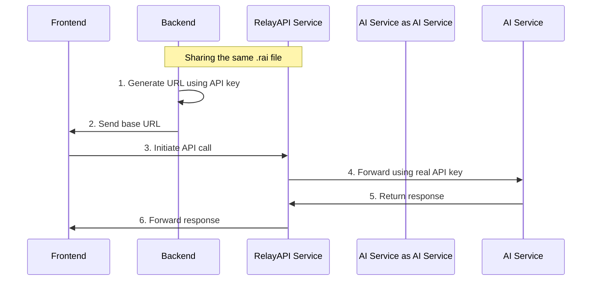

<div align="center">
  <h1>🚀 RelayAPI</h1>
  <p><strong>A secure, high-performance API proxy layer for secure AI service calls from frontend</strong></p>
  <p>
    <a href="README_CN.md">中文文档</a>
  </p>
  <p>
    <a href="https://github.com/relayapi/RelayAPI/stargazers">
      
    </a>
    <a href="https://github.com/relayapi/RelayAPI/network/members">
      
    </a>
    <a href="https://github.com/relayapi/RelayAPI/issues">
      
    </a>
    <a href="https://github.com/relayapi/RelayAPI/blob/main/LICENSE">
      
    </a>
  </p>
</div>

## 🌟 Features

RelayAPI is a secure API proxy service that helps you use various AI services safely on the frontend without exposing your API keys.

- 🔒 **Zero Leak Risk**: API keys are stored encrypted on the server, never exposed to the frontend.
- 🚀 **High Performance Design**: A high-performance proxy service implemented in Go, supporting large-scale concurrency.
- 🎯 **Precise Control**: Supports multi-dimensional access control based on usage count, time, IP, etc.
- 🔌 **Plug and Play**: Supports 90+ AI service providers, requiring zero changes on the frontend, just modify the BaseURL.
- 📊 **Real-time Monitoring**: Built-in call volume statistics, performance monitoring, error tracking, and more.
- 🛡️ **Multiple Protections**: Supports IP whitelisting, call frequency limits, concurrency control, and other security features.
- 🌐 **Multi-language SDK**: Provides SDKs for Node.js, Python, Go, and more.

## 🎯 How It Works



## 🚀 Quick Start

### Installation

# Quick installation of RelayAPI Server
```bash
curl -fsSL https://raw.githubusercontent.com/relayapi/RelayAPI/refs/heads/main/get_relayapi.sh | sh
```

```bash
# Backend SDK installation
npm install relayapi-sdk    # Node.js (@https://www.npmjs.com/package/relayapi-sdk)
pip install relayapi-sdk    # Python (@https://pypi.org/project/relayapi-sdk/)
```

## Three Steps to Get Started with RelayAPI

### Step 1: Start the Server

Create and modify the `default.rai` file to set encryption parameters:

```json
{
  "crypto": {
    "method": "aes",
    "aes_key": "your-secret-key",
    "aes_iv_seed": "your-seed-value"
  }
}
```

Start the server [Server Instructions](server/README.md):

```bash
./relayapi-server -rai ./default.rai 
```

### Step 2: Generate Base URL (Backend)

Use the same `default.rai` file in your backend code:

```python
from relayapi_sdk import RelayAPIClient

client = RelayAPIClient("default.rai")
base_url = client.generate_url(
    api_key="your-openai-api-key",
    max_calls=100,
    expire_seconds=3600
)
# Send base_url to the frontend
```

### Step 3: Use in Frontend

Use the base URL in your frontend code:

```javascript
import OpenAI from 'openai';

const openai = new OpenAI({
    baseURL: 'base_url obtained from backend',
    apiKey: 'no need to fill in api-key'
});

const response = await openai.chat.completions.create({
    model: 'gpt-3.5-turbo',
    messages: [{ role: 'user', content: 'Hello!' }]
});
```

## 🌈 Supported AI Service Providers

### Mainstream AI Model Services
- OpenAI (GPT-4, GPT-3.5)
- Anthropic (Claude)
- Google AI (PaLM, Gemini)
- Mistral AI
- Cohere
- AI21 Labs
- Hugging Face

### Cloud Service AI
- Azure OpenAI
- AWS Bedrock
- Google Cloud AI
- Alibaba Cloud Tongyi Qianwen
- Baidu Wenxin Yiyan
- Tencent Hunyuan
- Huawei Pangu

### Specialized AI
- Stability AI (Image Generation)
- DeepL (Translation)
- AssemblyAI (Speech Recognition)
- Speechmatics (Speech Processing)
- RunwayML (Video Generation)
- Wolfram Alpha (Scientific Computing)

> For the complete list of supported providers, please check the [Supported Providers List](docs/providers.md).

### Configuration

RelayAPI requires two configuration files:

1. `config.json` - Server configuration file (required)
   - Contains server settings, rate limits, and logging configurations.
   - Must exist when starting the server.
   - Example: [Server Configuration Guide](server/README.md).

2. `default.rai` - Client configuration file (automatically generated if not present)
   - Contains encryption settings and server connection information.
   - Used by the SDK to generate tokens and connect to the server.
   - Can be loaded from a file or passed directly as a configuration object.
   - Example: [JavaScript SDK Guide](backend-sdk/JavaScript/README.md) | [Python SDK Guide](backend-sdk/python/README.md).

For detailed configuration options and examples, please refer to the [Configuration Guide](docs/configuration_cn.md).

## 🔐 Security Notes

1. **Zero Trust Architecture**
   - API keys are stored and used only on the server.
   - All tokens are one-time use.
   - Supports IP binding and geographical location restrictions.

2. **Multiple Encryption**
   - Uses various encryption methods such as AES, ECC, etc.
   - Supports token replay attack prevention.
   - End-to-end HTTPS encryption.

3. **Access Control**
   - Precise call count limits.
   - Time-based token expiration.
   - Concurrency request control.
   - IP whitelisting mechanism.

## 🤝 Contribution Guidelines

We welcome all forms of contributions, whether it's new features, documentation improvements, or issue feedback!

1. Fork this repository.
2. Create a feature branch (`git checkout -b feature/AmazingFeature`).
3. Commit your changes (`git commit -m 'Add some AmazingFeature'`).
4. Push to the branch (`git push origin feature/AmazingFeature`).
5. Submit a Pull Request.

## 📄 Open Source License

This project is licensed under the [MIT](LICENSE) open-source license.
