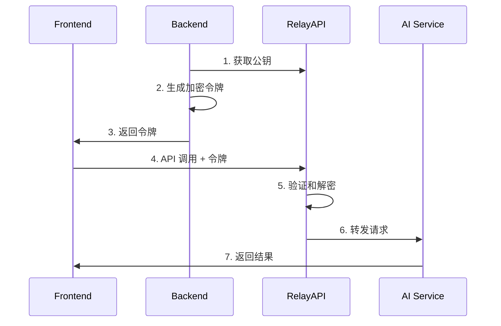

<div align="center">
  <h1>🚀 RelayAPI</h1>
  <p><strong>安全、高性能的 API 代理层，让前端安全调用 AI 服务</strong></p>
  <p>
    <a href="https://github.com/relayapi/RelayAPI/stargazers">
      
    </a>
    <a href="https://github.com/relayapi/RelayAPI/network/members">
      
    </a>
    <a href="https://github.com/relayapi/RelayAPI/issues">
      
    </a>
    <a href="https://github.com/relayapi/RelayAPI/blob/main/LICENSE">
      
    </a>
  </p>
</div>

## 🌟 特性

- 🔒 **零泄露风险**: API Key 完全在服务端加密存储，前端无法接触敏感信息
- 🚀 **高性能设计**: 基于 Go 实现的高性能代理服务，支持大规模并发
- 🎯 **精准控制**: 支持按次数、时间、IP 等多维度的访问控制
- 🔌 **即插即用**: 支持 90+ AI 服务商，前端零改动，仅需修改 BaseURL
- 📊 **实时监控**: 内置调用量统计、性能监控、错误追踪等功能
- 🛡️ **多重防护**: 支持 IP 白名单、调用频率限制、并发控制等安全特性
- 🌐 **多语言 SDK**: 提供 Node.js、Python、Go 等多语言 SDK

## 🎯 它是如何工作的？



## 🚀 快速开始

### 安装

```bash
# RelayAPI Server 快速安装
curl -fsSL https://relayapi.com/get_relayapi.sh | sh
```

```bash
# 后端 SDK 安装
npm install relayapi-sdk    # Node.js (@https://www.npmjs.com/package/relayapi-sdk)
pip install relayapi-sdk    # Python (@https://pypi.org/project/relayapi-sdk/)
```

### 后端使用示例

```typescript
import { RelayAPIClient } from 'relayapi-sdk';
import fs from 'fs/promises';

// 加载配置文件
const configContent = await fs.readFile('default.rai', 'utf-8');
const config = JSON.parse(configContent);

// 创建客户端实例
const client = new RelayAPIClient(config);

// 生成加密令牌
const token = client.createToken({
    apiKey: 'your-api-key',     // API Key
    maxCalls: 100,              // 最大调用次数
    expireSeconds: 3600,        // 有效期（秒）
    provider: 'openai'          // AI 服务商
});

// 生成 API URL
const baseUrl = client.generateUrl(token);
console.log('Base URL:', baseUrl);
// 输出示例: http://localhost:8080/relayapi/?token=xxxxx&rai_hash=xxxxx

// 返回给前端
return { baseUrl, token };
```

### 前端使用示例

```typescript
import OpenAI from 'openai';

const openai = new OpenAI({
    baseURL: baseUrl,
    apiKey: 'not-needed'  // API Key 已包含在 token 中
});

const response = await openai.chat.completions.create({
    messages: [{ role: 'user', content: 'Hello!' }],
    model: 'gpt-3.5-turbo',
    temperature: 0.7,
    maxTokens: 1000
});
```

## 🌈 支持的 AI 服务商

### 主流 AI 模型服务
- OpenAI (GPT-4, GPT-3.5)
- Anthropic (Claude)
- Google AI (PaLM, Gemini)
- Mistral AI
- Cohere
- AI21 Labs
- Hugging Face

### 云服务商 AI
- Azure OpenAI
- AWS Bedrock
- Google Cloud AI
- 阿里云通义千问
- 百度文心一言
- 腾讯混元
- 华为盘古

### 专业领域 AI
- Stability AI (图像生成)
- DeepL (翻译)
- AssemblyAI (语音识别)
- Speechmatics (语音处理)
- RunwayML (视频生成)
- Wolfram Alpha (科学计算)

> 完整支持列表请查看 [支持的服务商列表](docs/providers.md)

## 🔐 安全说明

1. **零信任架构**
   - API Key 仅在服务端存储和使用
   - 所有令牌均为一次性使用
   - 支持 IP 绑定和地理位置限制

2. **多重加密**
   - 采用 AES ECC等多种加密方式
   - 支持令牌防重放攻击
   - 全链路 HTTPS 加密

3. **访问控制**
   - 精确的调用次数限制
   - 基于时间的令牌失效
   - 并发请求控制
   - IP 白名单机制


## 🤝 贡献指南

我们欢迎所有形式的贡献，无论是新功能、文档改进还是问题反馈！

1. Fork 本仓库
2. 创建特性分支 (\`git checkout -b feature/AmazingFeature\`)
3. 提交改动 (\`git commit -m 'Add some AmazingFeature'\`)
4. 推送到分支 (\`git push origin feature/AmazingFeature\`)
5. 提交 Pull Request

## 📄 开源协议

本项目采用 [MIT](LICENSE) 开源协议。