<div align="center">
  <h1>🚀 RelayAPI</h1>
  <p><strong>安全、高性能的 API 代理层，让前端安全调用 AI 服务</strong></p>
  <p>
    <a href="README.md">English Documentation</a>
  </p>
  <p>
    <a href="https://github.com/relayapi/RelayAPI/stargazers">
      
    </a>
    <a href="https://github.com/relayapi/RelayAPI/network/members">
      
    </a>
    <a href="https://github.com/relayapi/RelayAPI/issues">
      
    </a>
    <a href="https://github.com/relayapi/RelayAPI/blob/main/LICENSE">
      
    </a>
  </p>
</div>

## 🌟 特性

RelayAPI 是一个安全的 API 代理服务，帮助您在前端安全地使用各种 AI 服务，无需暴露 API 密钥。

- 🔒 **零泄露风险**: 完全在服务端加密存储，API Key 永不暴露给前端
- 🚀 **高性能设计**: 基于 Go 实现的高性能代理服务，支持大规模并发
- 🎯 **精准控制**: 支持按次数、时间、IP 等多维度的访问控制
- 🔌 **即插即用**: 支持 90+ AI 服务商，前端零改动，仅需修改 BaseURL
- 📊 **实时监控**: 内置调用量统计、性能监控、错误追踪等功能
- 🛡️ **多重防护**: 支持 IP 白名单、调用频率限制、并发控制等安全特性
- 🌐 **多语言 SDK**: 提供 Node.js、Python、Go 等多语言 SDK


## 🎯 它是如何工作的？

```mermaid
sequenceDiagram
    participant Frontend as 前端
    participant Backend as 后端
    participant RelayAPI as RelayAPI服务
    participant AI Service as AI服务

    Note over Backend,RelayAPI: 共享相同的 .rai 文件
    Backend->>RelayAPI: 1. 使用 .rai 启动服务器
    Backend->>Backend: 2. 用 API key 生成 URL
    Backend->>Frontend: 3. 发送基础 URL
    Frontend->>RelayAPI: 4. 发起 API 调用
    RelayAPI->>AI Service: 5. 使用真实 API key 转发
    AI Service->>RelayAPI: 6. 返回响应
    RelayAPI->>Frontend: 7. 转发响应
```



## 🚀 快速开始

### 安装

```bash
# RelayAPI Server 快速安装
curl -fsSL https://raw.githubusercontent.com/relayapi/RelayAPI/refs/heads/main/get_relayapi.sh | sh
```

```bash
# 后端 SDK 安装
npm install relayapi-sdk    # Node.js (@https://www.npmjs.com/package/relayapi-sdk)
pip install relayapi-sdk    # Python (@https://pypi.org/project/relayapi-sdk/)
```

## 三步上手 RelayAPI

### 第一步：启动服务器

创建 `default.rai` 文件，设置加密参数：

```json
{
    // 前后端共享相同的 .rai 文件
  "crypto": {
    "method": "aes",
    "aes_key": "你的密钥",
    "aes_iv_seed": "你的种子值"
  }
}
```

启动服务器：

```bash
relayapi-server -rai ./rai -d
```

### 第二步：生成基础 URL（后端）

在后端代码中使用相同的 `default.rai` 文件：

```python
from relayapi_sdk import RelayAPIClient

client = RelayAPIClient("default.rai")
base_url = client.generate_url(
    api_key="你的-openai-api-key",
    max_calls=100,
    expire_seconds=3600
)
# 将 base_url 发送给前端
```

### 第三步：前端使用

在前端代码中使用基础 URL：

```javascript
import OpenAI from 'openai';

const openai = new OpenAI({
    baseURL: '从后端获取的base_url',
    apiKey: '不需要填写api-key'
});

const response = await openai.chat.completions.create({
    model: 'gpt-3.5-turbo',
    messages: [{ role: 'user', content: '你好！' }]
});
```


### 配置

RelayAPI 需要两种配置文件：

1. `config.json` - 服务器配置文件（必需）
   - 包含服务器设置、速率限制和日志配置
   - 启动服务器时必须存在
   - 示例：[服务器配置指南](server/README.md)

2. `default.rai` - 客户端配置文件（如不存在则自动生成）
   - 包含加密设置和服务器连接信息
   - 用于 SDK 生成令牌和连接服务器
   - 可以从文件加载或直接传入配置对象
   - 示例：[JavaScript SDK 指南](backend-sdk/JavaScript/README.md) | [Python SDK 指南](backend-sdk/python/README.md)

详细配置选项和示例请参考[配置指南](docs/configuration_cn.md)。


## 🌈 支持的 AI 服务商

### 主流 AI 模型服务
- OpenAI (GPT-4, GPT-3.5)
- Anthropic (Claude)
- Google AI (PaLM, Gemini)
- Mistral AI
- Cohere
- AI21 Labs
- Hugging Face

### 云服务商 AI
- Azure OpenAI
- AWS Bedrock
- Google Cloud AI
- 阿里云通义千问
- 百度文心一言
- 腾讯混元
- 华为盘古

### 专业领域 AI
- Stability AI (图像生成)
- DeepL (翻译)
- AssemblyAI (语音识别)
- Speechmatics (语音处理)
- RunwayML (视频生成)
- Wolfram Alpha (科学计算)

> 完整支持列表请查看[支持的服务商列表](docs/providers.md)

## 🔐 安全说明

1. **零信任架构**
   - API Key 仅在服务端存储和使用
   - 所有令牌均为一次性使用
   - 支持 IP 绑定和地理位置限制

2. **多重加密**
   - 采用 AES、ECC 等多种加密方式
   - 支持令牌防重放攻击
   - 全链路 HTTPS 加密

3. **访问控制**
   - 精确的调用次数限制
   - 基于时间的令牌失效
   - 并发请求控制
   - IP 白名单机制

## 🤝 贡献指南

我们欢迎所有形式的贡献，无论是新功能、文档改进还是问题反馈！

1. Fork 本仓库
2. 创建特性分支 (\`git checkout -b feature/AmazingFeature\`)
3. 提交改动 (\`git commit -m 'Add some AmazingFeature'\`)
4. 推送到分支 (\`git push origin feature/AmazingFeature\`)
5. 提交 Pull Request

## 📄 开源协议

本项目采用 [MIT](LICENSE) 开源协议。

# RelayAPI

[English](README.md)

RelayAPI 是一个安全的 API 代理服务，帮助您在前端安全地使用各种 AI 服务，无需暴露 API 密钥。

## 三步上手 RelayAPI

### 第一步：启动服务器
创建 `default.rai` 文件，设置加密参数：
```json
{
  "crypto": {
    "method": "aes",
    "aes_key": "你的密钥",
    "aes_iv_seed": "你的种子值"
  }
}
```
启动服务器：
```bash
relayapi-server -rai ./rai -d
```

### 第二步：生成基础 URL（后端）
在后端代码中使用相同的 `default.rai` 文件：
```python
from relayapi_sdk import RelayAPIClient

client = RelayAPIClient("default.rai")
base_url = client.generate_url(
    api_key="你的-openai-api-key",
    max_calls=100,
    expire_seconds=3600
)
# 将 base_url 发送给前端
```

### 第三步：前端使用
在前端代码中使用基础 URL：
```javascript
import OpenAI from 'openai';

const openai = new OpenAI({
    baseURL: '从后端获取的base_url',
    apiKey: '不需要填写api-key'
});

const response = await openai.chat.completions.create({
    model: 'gpt-3.5-turbo',
    messages: [{ role: 'user', content: '你好！' }]
});
```


### 工作原理


主要优势：
- 🔒 API 密钥永不暴露给前端
- 🎯 精细的访问控制
- 🚀 简单易用，快速部署

## 安装

```bash
# RelayAPI 服务器快速安装
curl -fsSL https://relayapi.com/get_relayapi.sh | sh
```

```bash
# 后端 SDK 安装
npm install relayapi-sdk    # Node.js (@https://www.npmjs.com/package/relayapi-sdk)
pip install relayapi-sdk    # Python (@https://pypi.org/project/relayapi-sdk/)
```